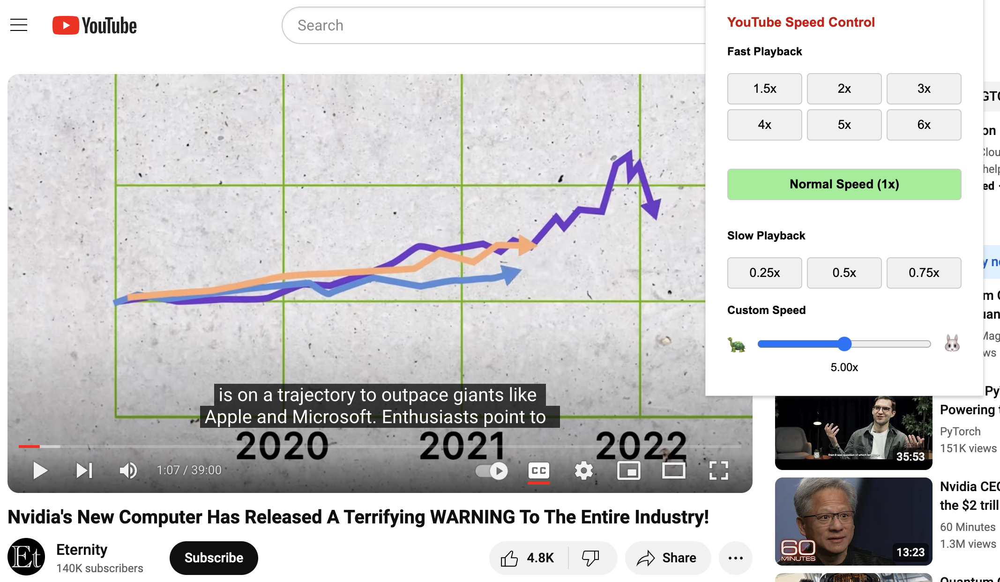

# Video Speed Control

## Description

Video Speed Control is a Chrome extension that allows users to easily adjust the playback speed of videos across various platforms. While initially optimized for YouTube, it can potentially work on any website that uses standard HTML5 video players, including platforms like Bilibili.

## Screenshot

## Features

- Quick preset speeds: 0.25x, 0.5x, 0.75x, 1.5x, 2x, 3x, 4x, 5x, 6x
- One-click normal speed (1x) button
- Custom speed slider for precise control (0.1x to 10x)
- Intuitive popup interface
- Compatible with YouTube and potentially other video streaming websites

## Compatibility

- Fully supported: YouTube
- Potentially supported: Other websites using standard HTML5 video players (e.g., Bilibili)
- Note: Functionality on non-YouTube sites is not guaranteed and may vary

## Installation

1. Clone this repository or download the ZIP file.
2. Open Chrome and navigate to `chrome://extensions`.
3. Enable "Developer mode" in the top right corner.
4. Click "Load unpacked" and select the directory containing the extension files.

## Usage

1. Navigate to a video page (YouTube or other supported sites).
2. Click on the Video Speed Control extension icon in your Chrome toolbar.
3. Use the preset buttons or custom slider to adjust the video playback speed.
4. The speed change will be applied immediately to the current video.

## Development

To modify or enhance this extension:

1. Make changes to the files in the `src` directory.
2. Update the manifest file if necessary.
3. Reload the extension in Chrome to see your changes.

## Contributing

Contributions are welcome! If you've successfully used this extension on other video platforms, please consider contributing to improve compatibility. Feel free to submit a Pull Request.

## License

[MIT License](LICENSE)

## Contact

If you have any questions, suggestions, or reports of compatibility with other websites, please open an issue in this repository.

## Disclaimer

While this extension may work on various video streaming websites, its functionality outside of YouTube is not guaranteed. Users should be aware that the extension's behavior might differ or be limited on non-YouTube platforms.
